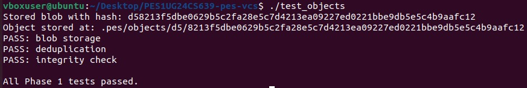
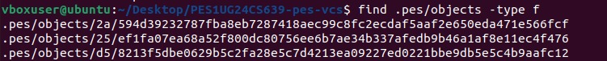
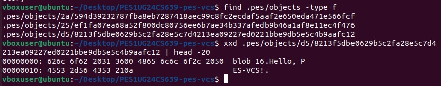
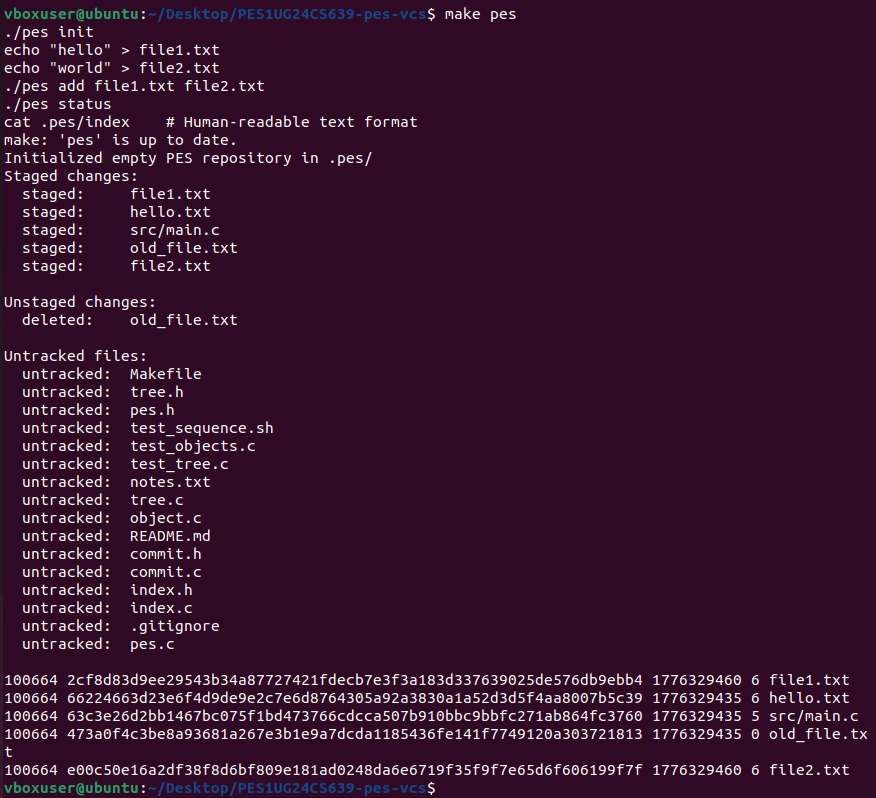
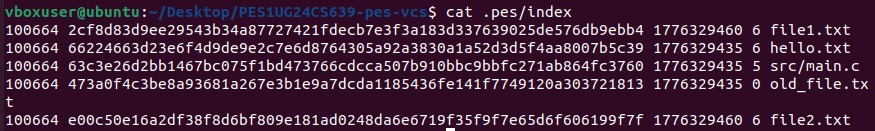
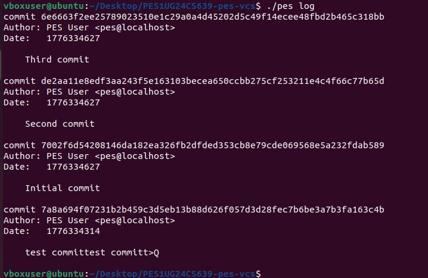
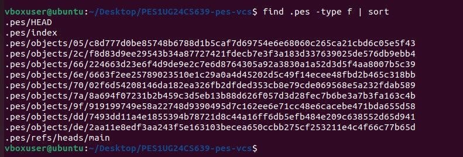
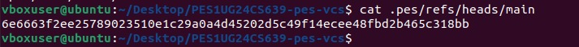

# PES-VCS Project

## Student Details
Name: Tilak R Biradar
SRN: PES1UG24CS639 

---

## Phase 1: Object Storage

In this phase, I implemented the basic object storage system. 
It stores blobs using SHA-256 hashing and organizes them inside `.pes/objects`.

### Screenshot 1A: Test Objects Output

### Screenshot 1B: Object Storage Structure

---

## Phase 2: Tree Objects

Here, I worked on tree objects which represent directory structure. 
The tree is built from entries and then serialized and stored.

### Screenshot 2A: Test Tree Output

### Screenshot 2B: Raw Tree Object

---

## Phase 3: Index (Staging Area)

In this phase, I implemented the staging area (index). 
It keeps track of files that are added before committing.

### Screenshot 3A: Init → Add → Status

### Screenshot 3B: Index File Content

---

## Phase 4: Commits and History

This phase handles commit creation and history tracking. 
Each commit stores metadata like author, message, and tree reference.

### Screenshot 4A: Log Output

### Screenshot 4B: Object Growth

### Screenshot 4C: HEAD and Branch Reference

---

## Final Integration Test

This shows that all components (object, tree, index, commit) are working together.

---

## Phase 5 & 6: Analysis Questions

### Q5.1 Branch & Checkout
To implement pes checkout <branch>, the system reads the commit hash from .pes/refs/heads/<branch>, updates HEAD to point to that branch, and loads the corresponding commit and its tree from the object store. The working directory is then updated to match this tree by creating required files and directories, overwriting changed files, and deleting extra ones. This operation is complex because it requires reconstructing the entire directory structure while safely handling overwrites and preventing data loss.

 ---
 
### Q5.2 Switching Branches
A dirty working directory is detected by comparing the working directory with the index and the target branch. First, if a file in the working directory differs from the index, it means it has uncommitted changes. Then, if that same file also differs between the index and the target branch’s tree, a conflict exists. In such cases, checkout must be refused to prevent loss of uncommitted changes.

---

### Q5.3 Detached HEAD
In a detached HEAD state, HEAD points directly to a commit instead of a branch. Any new commits made in this state are not referenced by any branch, making them unreachable once the user switches branches. These commits can still be recovered by creating a new branch at that commit or by using the commit hash to reattach and then saving it with a branch.

---

### Q6.1 Garbage Collection
Garbage collection can be implemented using a mark-and-sweep algorithm. Starting from all branch heads and HEAD, the system traverses commits, trees, and blobs, marking all reachable objects using a hash set. After traversal, any unmarked objects are deleted as they are unreachable. For a repository with 100,000 commits and 50 branches, due to shared history, approximately 300,000 to 500,000 objects would be visited.

---

### Q6.2 GC Race ConditionRunning garbage collection concurrently with a commit operation is dangerous because of race conditions. While GC is identifying unreachable objects, a new commit may be in the process of referencing them. If GC deletes such objects prematurely, the commit will reference missing data, causing corruption. Git avoids this using locking mechanisms, immutable objects, delayed deletion, and reflog protection to ensure objects are not removed while still in use.

---
